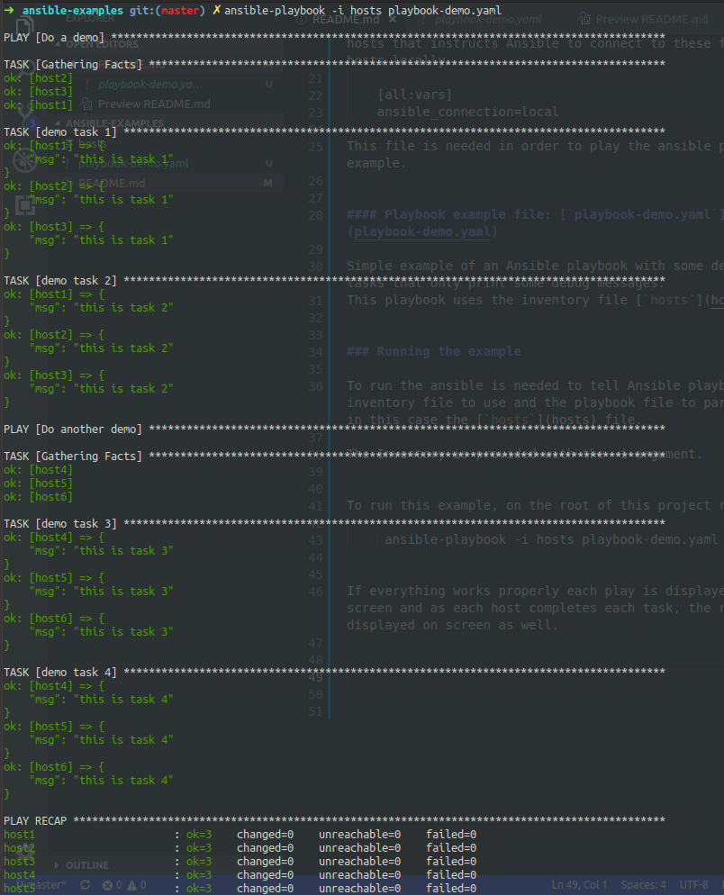

# ansible-examples

Project with some examples of how to use [Ansible](https://www.ansible.com/).

To run these examples will need to have the ansible tool installed. To install please follow the official [doc](https://docs.ansible.com/ansible/latest/installation_guide/intro_installation.html).

## Ansible playbooks

For this example the project has two files:

- a [inventory](https://docs.ansible.com/ansible/latest/user_guide/intro_inventory.html) file called [`hosts`](hosts).

- a playbook example file called [`playbook-demo.yaml`](playbook-demo.yaml).

##### Inventory file: [`hosts`](hosts) 

The inventory file on this project will just be a set of hosts in a couple of groups. Each host is uniquely named so that we can distinguish it in the output. 

To run this example is defined too a variable for all the hosts that instructs Ansible to connect to these fake hosts locally.

    [all:vars]
    ansible_connection=local

This file is needed in order to play the ansible playbook example.

##### Playbook example file: [`playbook-demo.yaml`](playbook-demo.yaml)

Simple example of an Ansible playbook with some debug tasks that only print some debug messages. 
This playbook uses the inventory file [`hosts`](hosts) 

### Running the example

To run the ansible is needed to tell Ansible playbook the inventory file to use and the playbook file to parse that in this case the [`hosts`](hosts) file.

The Inventory is provided with the -i argument.

To run this example, on the root of this project run:

     ansible-playbook -i hosts playbook-demo.yaml

If everything works properly each play is displayed on screen and as each host completes each task, the result is displayed on screen like the following image:

